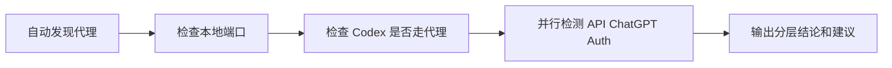

# Codex Reconnect Doctor

一个运行在 macOS 菜单栏的 Codex 网络链路诊断工具。它用于区分本地代理未启动、代理端口异常、节点超时、OpenAI API 可达但 ChatGPT/Auth 受到挑战，以及 Codex 未确认走代理等情况。

## 为什么做这个工具

Codex 出现 `reconnecting` 时，问题可能发生在本地代理、代理节点、ChatGPT/Auth 会话链路或 Codex 启动环境。过去需要分别检查代理客户端、端口、浏览器和进程连接；本工具把这些检查收敛为一次本地诊断。



## 当前能力

- 自动读取 macOS 系统代理和 `launchctl` 代理环境变量
- 自动发现常见本地 HTTP 代理端口
- 检查 Libcyber Desktop、Shadowrocket、Clash、Mihomo 等代理进程
- 检查 Codex 是否连接到本地代理
- 并行检测 OpenAI API、ChatGPT 和 Auth 链路
- 通过绿色、黄色、红色菜单栏状态展示结论
- 默认每 15 分钟自动检查，支持手动重测
- 保存最近 30 次本地检测结果
- 打开代理客户端、复制启动命令、按代理方式重启 Codex
- 所有检测均在本机完成，不上传诊断记录

## 状态含义

- 绿色：服务可达、响应速度正常，并确认 Codex 使用代理
- 黄色：服务可达但较慢，或未确认 Codex 使用代理
- 红色：代理节点不可用、部分服务不可达，或检测到 Cloudflare challenge
- 灰色：未发现有效代理配置，或正在检查

## 构建

系统要求：macOS 13 或更高版本、Swift 6 Command Line Tools。

```bash
chmod +x scripts/build.sh scripts/package.sh
./scripts/build.sh
```

应用生成在：

```text
build/Codex Reconnect Doctor.app
```

命令行诊断：

```bash
./build/Codex\ Reconnect\ Doctor.app/Contents/MacOS/CodexReconnectDoctor --diagnose
```

生成可发布的 ZIP：

```bash
./scripts/package.sh
```

## 安装

将 `Codex Reconnect Doctor.app` 拖入“应用程序”后启动。未签名版本第一次启动时，可能需要在访达中右键选择“打开”。

首次启动会自动读取系统代理和登录环境变量。自动发现失败时，可从菜单栏进入“设置”，手动填写本地 HTTP 代理地址与端口。

## 数据与隐私

检测历史仅保存在：

```text
~/Library/Application Support/CodexReconnectDoctor/history.json
```

工具不会读取代理订阅、节点名称、账号信息或浏览器内容。

## 边界

- 工具不会自动切换代理节点。
- 工具不会绕过登录、认证或平台安全机制。
- 工具不会未经确认修改系统代理或退出 Codex。
- HTTP 状态和网络环境可能变化，诊断结论用于缩小排查范围，不替代服务商支持。

## 许可证

本项目采用 [MIT License](LICENSE)。
